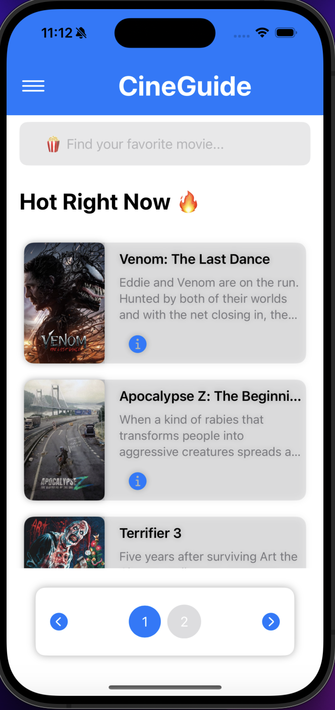
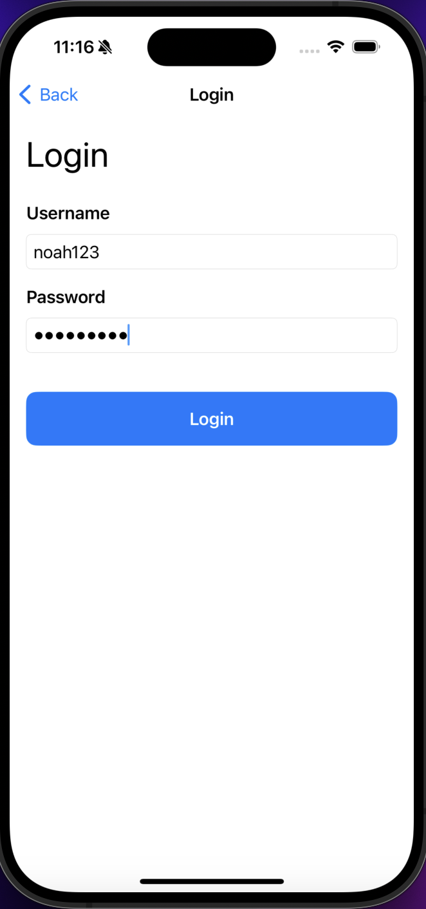
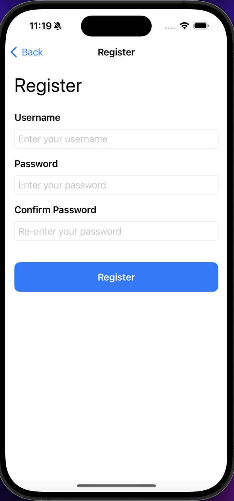
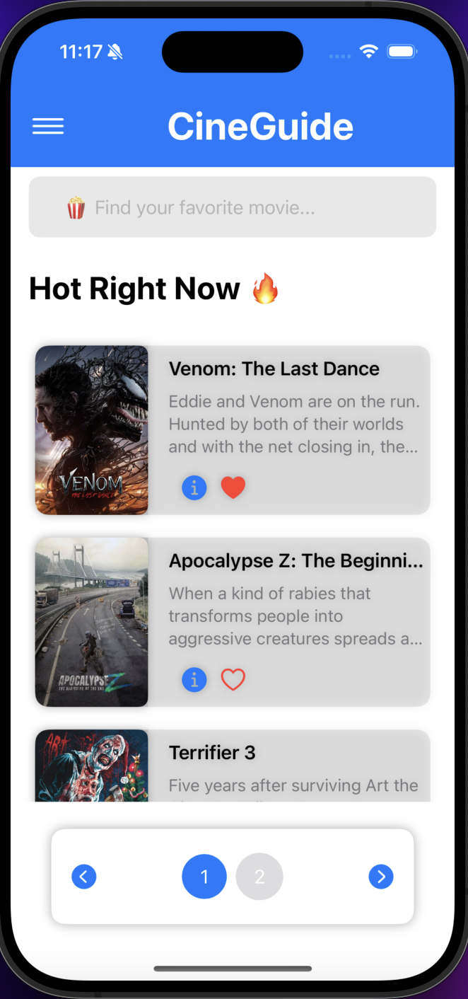
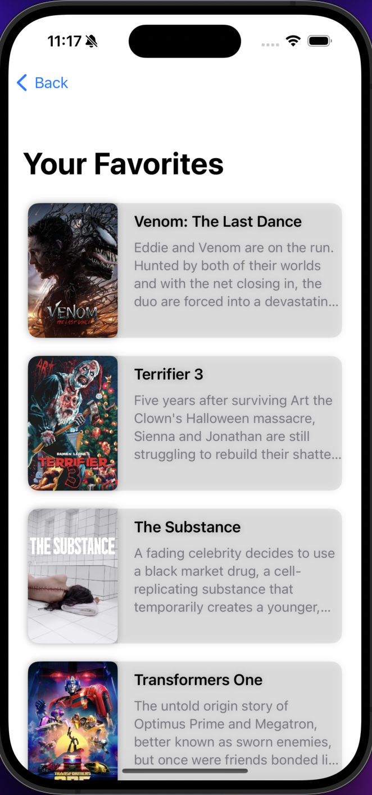
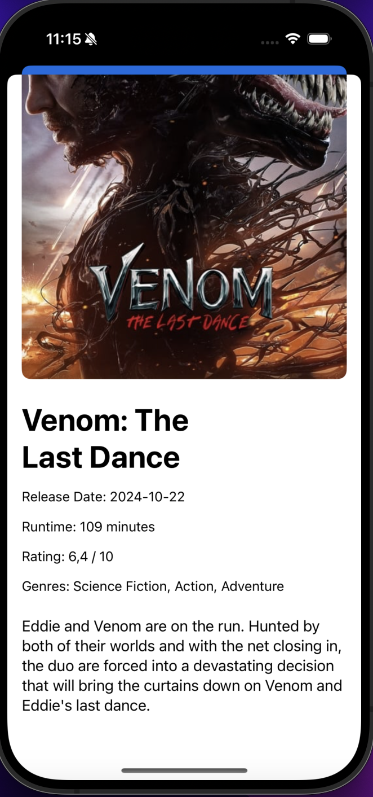

# CineGuide 🎬

Welcome to **CineGuide** – your personal movie guide app! 🎥🍿 With CineGuide, you can discover trending movies, search for your favorite films, and explore detailed information about them all in one place.

## Features

- 🔥 **Hot Right Now**: Stay updated with the most popular movies currently trending.
- 🔍 **Search Movies**: Search for your favorite films and discover related titles while typing.
- 📜 **Movie Details**: Get detailed information about each movie, including plot summaries and posters.
- 🎬 **Smooth UI**: Enjoy a sleek and modern user interface that provides a seamless movie browsing experience.

## Screenshots

### Main Screen
Discover trending movies and navigate easily within the app.

    

### Login Screen
Securely log in to access personalized features.

    

### Register Screen
Create a new account to start adding favorites.

    

### Logged In - Main Screen
View your account-specific content once logged in.

    

### Favorites Screen
See your favorite movies collected in one place.

    

### Detailed Movie View
Get in-depth information on each movie, including runtime, genres, and plot.

    

---

## Technologies Used

- **SwiftUI** for the UI
- **Firebase Firestore** for backend data storage
- **The Movie Database (TMDB) API** for movie data
- **AsyncImage** for loading images asynchronously
- **Xcode** for development
